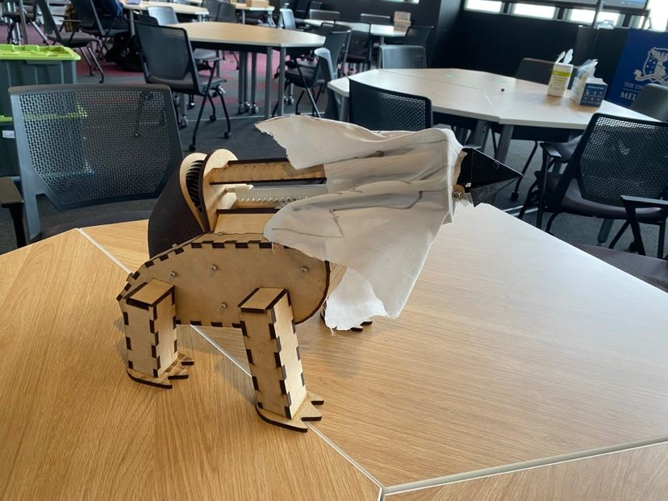
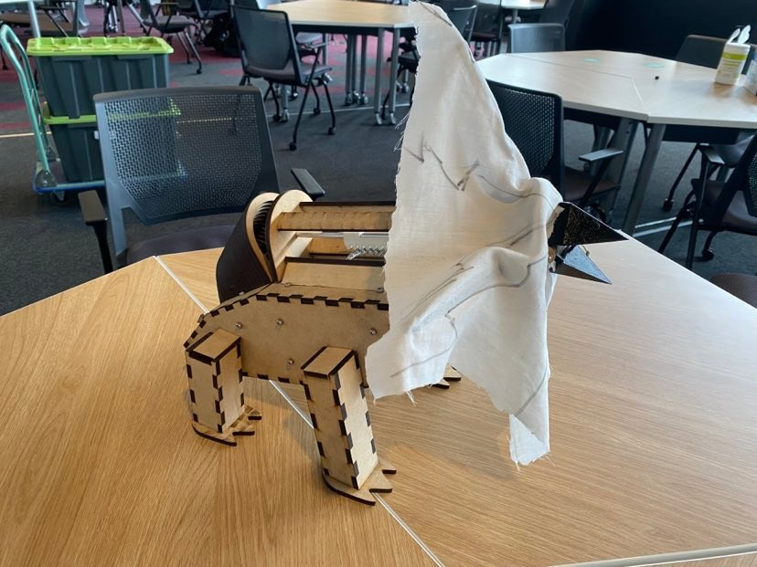

# Frill Neck Lizard project

# Introduction
 This is a project from our core subject which requires us to
design and making an animal-like robot. This robot must have at least
one interaction such as triggered by loud noise, close object...

# Overview
 - We started with Concept Development which we chose the best option according to our criteria.
 After we chose the concept for our animal which is frill neck lizard, we continually chose the 
 mechanism for the core motion inside the animal which is opening the frill by analysing the pros
 and cons from making each idea.
 
 - We started with the frill first since it was the critical aspect for our project, Due to the limitation of the time, we began with the simulation of motion before making stuff
to validate our design for the frill. After stimulation, we kept going with the design for the housing, legs, and the tail for out pet which will be discussed in detail in the report.

 - Simultaneously, the electrical part of our pet was tested and added to the housing for controlling the servo to open the frill.

 - For any steps for our project, we always did the prototype tests to commit each step or check for any errors for that design before keeping making it.

# Mechanics and Materials
 - We did the material selection for our critical aspect for the lizard.
 - The calculation for the force to push out the frill was considered carefully which gave the information
   for choosing the parameters for rack and pinion mechanism.
 - All dimensioned drawings for each part will be demonstrated in the report.

#Isometric view

